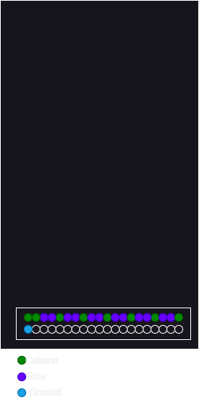

Simple and naive implementation of a driver for a custom made LED matrix, 12X8. The project was build for learning purposes.

It supports writing the letters statically or scrolling a text along with basic lines and dots in either portrait or landscape mode.

The PICO pin are connected as follows
- 0 to 7 - column PINs
- 8 to 19 - row PINs

The pins on the board are numbered from left to right (Column0 is above the ground pin) with the first two representing columns then alternating between 2 representing rows followed by 1 column.

